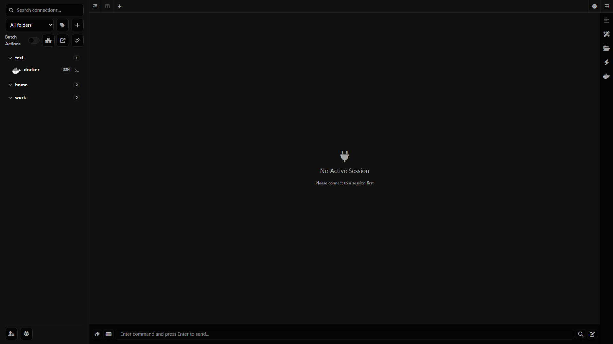
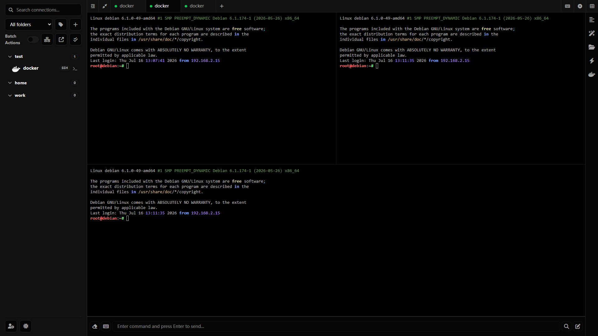
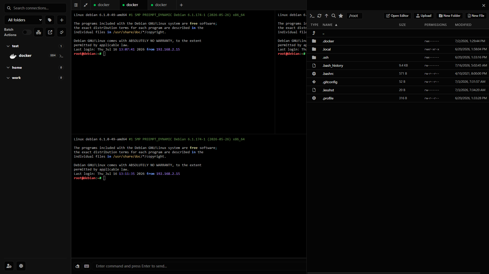
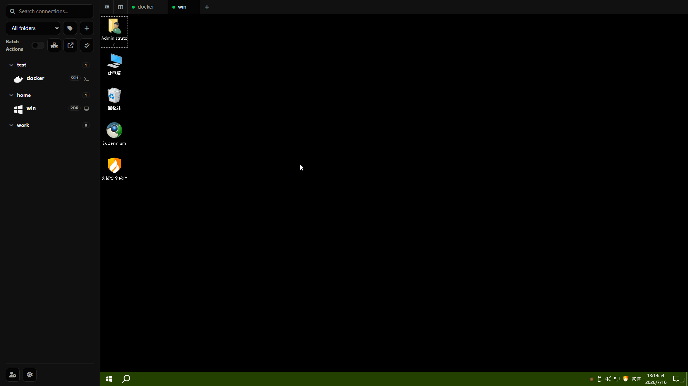
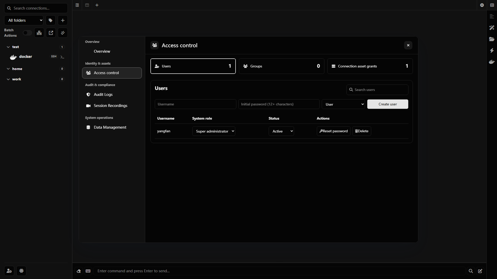

<div align="center">


# Fantetic Terminal

### Modern remote workspace for SSH, RDP, VNC and SFTP

**Web Terminal · Remote Desktop · SFTP · Session Recording · Admin Center · Electron Desktop**

<br />

[English](./README.md) | [中文](./README_CN.md)

[](#quick-start)
[](./LICENSE)
[](https://github.com/spfantop/fantetic-terminal/releases)
[](https://www.typescriptlang.org/)
[](https://vuejs.org/)
[](./electron-app)

<br />

**Fantetic Terminal** is a self-hosted remote access workspace for developers, DevOps teams, homelab users and small teams.

It brings together **SSH**, **Telnet**, **RDP**, **VNC**, **SFTP**, session management, auditing, recording, backup and desktop access in one modern interface.

<br />

[Quick Start](#quick-start) · [Features](#features) · [Screenshots](#screenshots) · [Comparison](#comparison) · [Architecture](#architecture) · [Roadmap](#roadmap)

</div>

---

## Why Fantetic Terminal?

Most remote access tools focus on only one side of the workflow.

Fantetic Terminal is designed as a **remote workspace**, not just a web SSH page.

| What you need           | Fantetic Terminal provides                                  |
| ----------------------- | ----------------------------------------------------------- |
| Work with Linux servers | SSH, Telnet, tabs, split panes, session suspension          |
| Manage files            | SFTP, drag-and-drop upload, online editing, file operations |
| Access desktops         | RDP and VNC through an isolated Remote Gateway              |
| Use it like an app      | Web, PWA and Electron desktop client                        |
| Manage team access      | Users, groups, roles and asset permissions                  |
| Review activity         | Audit logs and encrypted terminal recordings                |
| Self-host everything    | Docker deployment with local data ownership                 |

---

## Preview
<div align="center">


</div>

---

## Features

### Remote Workspace

* SSH and Telnet terminal sessions
* Multiple tabs, split panes and pop-out windows
* Session reconnect, heartbeat and suspension
* Command history, quick commands and path history
* Customizable terminal layout and appearance
* Mobile-friendly terminal interaction
* PWA support

### File Management

* SFTP file manager
* Drag-and-drop upload
* Multi-select file operations
* Rename, copy, move, delete and permission changes
* Archive and extract operations
* Online editing with Monaco Editor and mobile CodeMirror editor
* Favorite paths and path history

### Remote Desktop

* RDP access
* VNC access
* Isolated Remote Gateway boundary
* One-time remote desktop grants
* guacd integration

### Administration

* Multi-user management
* System roles: `super_admin`, `admin`, `auditor`, `user`
* User groups and asset authorization
* View, connect and manage permissions
* Bulk asset grants
* Asset transfer when deleting users
* Role-aware Admin Center

### Security

* Passkey support
* CAPTCHA
* Two-factor authentication
* IP allow/deny lists
* HTTP and WebSocket origin checks
* User-level rate limiting
* Session revocation
* Sensitive log masking
* Encrypted notification credentials
* Electron sandboxing and IPC sender validation

### Audit, Recording and Recovery

* Structured audit logs
* Actor, request, IP, asset and session correlation
* Encrypted SSH/Telnet session recordings
* Recording search, filtering and playback
* Backup creation
* Backup integrity verification
* Guided restore scheduling
* Interrupted-recording recovery

### Desktop Client

* Standalone Electron desktop client
* Windows installer and portable package
* Local-first runtime
* Per-launch backend nonce
* Restricted renderer permissions

> The desktop client is designed for local terminal usage. Web account administration and packaged RDP/VNC gateway capabilities are provided by the self-hosted server deployment.

---

## Screenshots

### Terminal Workspace



### Split Pane



### File Manager



### Remote Desktop



### Admin Center



---

## Quick Start

### 1. Download the Compose file

```bash
mkdir ./fantetic-terminal
cd ./fantetic-terminal

wget https://raw.githubusercontent.com/spfantop/fantetic-terminal/refs/heads/main/docker-compose.yml -O docker-compose.yml
wget https://raw.githubusercontent.com/spfantop/fantetic-terminal/refs/heads/main/.env.example -O .env
```

### 2. Start Fantetic Terminal

```bash
docker compose up -d
```

### 3. Open the web interface

```text
http://localhost:18111
```

Source checkout is not required when using the published Docker images.

---

## Configuration

On the first startup, the backend automatically generates strong random values for:

* `ENCRYPTION_KEY`
* `SESSION_SECRET`
* `REMOTE_GATEWAY_SHARED_SECRET`

These values are saved to:

```text
./data/.env
```

Keep this file private and include it in backups.

Deleting or replacing it may make previously encrypted data unreadable and invalidate active sessions.

For production deployment, configure these values in `.env`:

```env
RP_ID=your-domain.com
RP_ORIGIN=https://your-domain.com
CORS_ALLOWED_ORIGINS=https://your-domain.com
```

Use HTTPS in production. Browser APIs such as secure cookies, clipboard and Passkeys may not work correctly on non-HTTPS origins except localhost.

---

## Reverse Proxy Example

```nginx
location / {
    proxy_http_version 1.1;
    proxy_set_header Upgrade $http_upgrade;
    proxy_set_header Connection "upgrade";
    proxy_set_header X-Forwarded-For $proxy_add_x_forwarded_for;
    proxy_set_header X-Forwarded-Proto $scheme;
    proxy_set_header Host $http_host;
    proxy_set_header X-Real-IP $remote_addr;
    proxy_set_header Range $http_range;
    proxy_set_header If-Range $http_if_range;
    proxy_redirect off;
    proxy_pass http://127.0.0.1:18111;
}
```

---

## ARM Notes

For `arm64`, replace:

```yaml
guacamole/guacd:latest
```

with:

```yaml
guacamole/guacd:1.6.0-RC1
```

For `armv7`, use the dedicated Compose file. RDP/VNC is disabled on armv7 because guacd does not provide an armv7 image.

---

## Architecture

```text
Browser / PWA / Electron
        |
        v
Frontend
        |
        v
Backend API + WebSocket
        |
        +-------------------+
        |                   |
        v                   v
SSH / Telnet / SFTP     Remote Gateway
                            |
                            v
                          guacd
                            |
                     +------+------+
                     |             |
                    RDP           VNC
```

Fantetic Terminal uses a monorepo structure:

```text
fantetic-terminal
├── packages
│   ├── backend
│   ├── contracts
│   ├── frontend
│   └── remote-gateway
├── electron-app
├── build-tools
├── docs
├── docker-compose.yml
└── package.json
```

---

## Comparison

| Feature                     | Fantetic Terminal | Nexterm | Apache Guacamole | JumpServer |
| --------------------------- | ----------------: | ------: | ---------------: | ---------: |
| SSH terminal                |                 ✅ |       ✅ |                ✅ |          ✅ |
| Telnet                      |                 ✅ |       ✅ |                ✅ |          ✅ |
| SFTP file manager           |                 ✅ |       ✅ |                ❌ |          ✅ |
| RDP                         |                 ✅ |      ⚠️ |                ✅ |          ✅ |
| VNC                         |                 ✅ |      ⚠️ |                ✅ |          ✅ |
| Web interface               |                 ✅ |       ✅ |                ✅ |          ✅ |
| Electron desktop client     |                 ✅ |       ❌ |                ❌ |          ❌ |
| PWA                         |                 ✅ |      ⚠️ |                ❌ |          ❌ |
| Multi-user management       |                 ✅ |       ✅ |               ⚠️ |          ✅ |
| User groups                 |                 ✅ |      ⚠️ |                ❌ |          ✅ |
| Asset authorization         |                 ✅ |       ✅ |               ⚠️ |          ✅ |
| Session recording           |                 ✅ |       ❌ |               ⚠️ |          ✅ |
| Admin Center                |                 ✅ |       ✅ |               ⚠️ |          ✅ |
| Lightweight self-hosting    |                 ✅ |       ✅ |                ✅ |         ⚠️ |
| Enterprise bastion features |                ⚠️ |      ⚠️ |                ❌ |          ✅ |

> This comparison is based on general product positioning. Feature depth may vary by version and deployment method.

---

## Project Positioning

Fantetic Terminal is currently best suited for:

* Personal server management
* Homelab environments
* Small team remote access
* Lightweight DevOps workspaces
* Self-hosted remote terminal and desktop management
* Teams that want one place for SSH, SFTP, RDP and VNC

It is **not yet positioned as a full enterprise bastion host replacement**.

For enterprise-grade bastion scenarios, you may still need:

* Approval workflows
* Stronger immutable audit storage
* High availability
* Horizontal scaling
* More complete compliance controls
* Centralized secrets and credential rotation

---

## Roadmap

### Completed

* SSH terminal
* Telnet terminal
* SFTP file management
* RDP and VNC gateway
* Multi-tab workspace
* Split panes
* Session suspension
* Multi-user management
* User groups and asset grants
* Passkey, CAPTCHA and 2FA
* Audit logs
* Encrypted terminal recordings
* Backup and restore
* PWA
* Electron desktop client

---

## Development

```bash
git clone https://github.com/spfantop/fantetic-terminal.git
cd fantetic-terminal

npm install
npm run dev
```

Build:

```bash
npm run build
```

Desktop packaging:

```bash
cd electron-app
npm install
npm run build
```

---

## Security Notes

Fantetic Terminal handles sensitive data such as server credentials, private keys, session tokens and remote access traffic.

Before using it in production:

* Enable HTTPS
* Keep `./data/.env` private
* Back up the mounted `data` directory
* Review reverse proxy configuration
* Restrict trusted origins
* Use strong admin credentials
* Enable 2FA where possible
* Review whether terminal input recording is legally and organizationally acceptable

---

## Acknowledgements

Fantetic Terminal is developed from [Heavrnl/nexus-terminal](https://github.com/Heavrnl/nexus-terminal).

Thanks to the original author and the open-source projects that make this project possible.

Terminal color presets are based on [iTerm2-Color-Schemes](https://github.com/mbadolato/iTerm2-Color-Schemes).

---

## License

Fantetic Terminal is licensed under [GPL-3.0](./LICENSE).

---

<div align="center">

If you find Fantetic Terminal useful, please consider giving it a star.

**Star · Fork · Share · Contribute**

</div>
