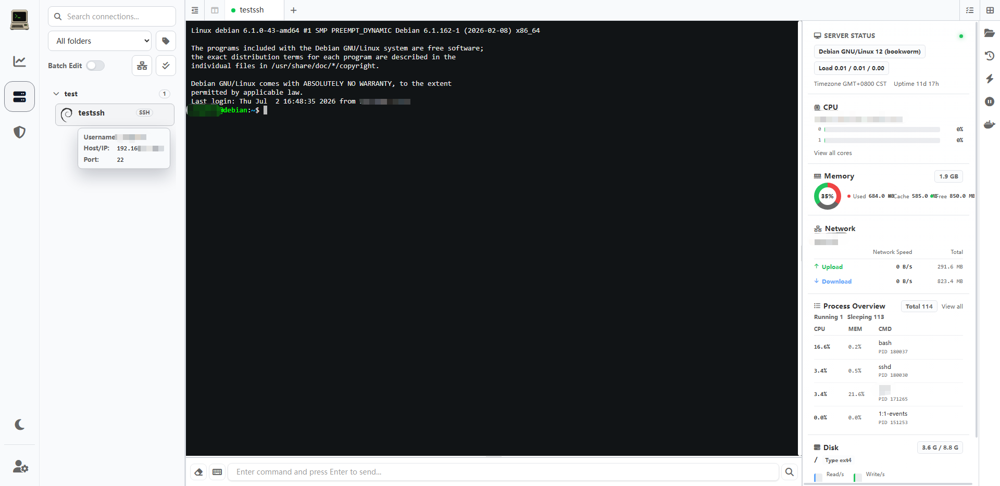
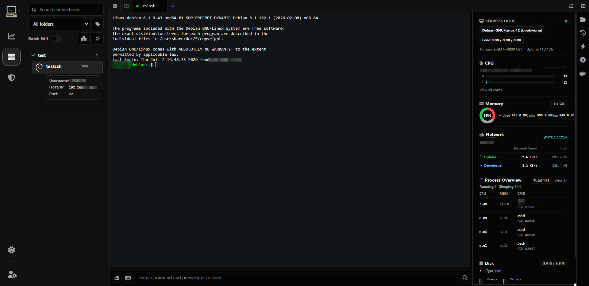
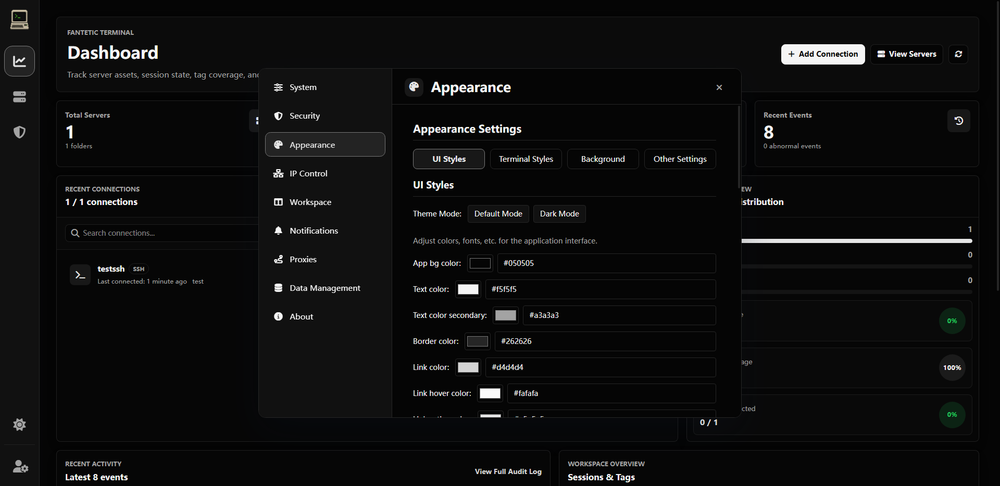

---

<div align="center">

[][docker-url] [](https://github.com/spfantop/fantetic-terminal/blob/main/LICENSE)

[English](./README.md) | [中文](./README_CN.md)

[docker-url]: https://hub.docker.com/r/spfantop/fantetic-terminal-frontend

</div>

## 📖 Overview

**Fantetic Terminal** is a modern web and desktop remote-access workspace for SSH, Telnet, RDP, and VNC. It combines terminal sessions, SFTP file management, online editing, administrative controls, auditing, encrypted recordings, and verified backup/restore in one customizable interface.

This project is developed from [Heavrnl/nexus-terminal](https://github.com/Heavrnl/nexus-terminal). Many thanks to the original author.

- Maintained repository: [spfantop/fantetic-terminal](https://github.com/spfantop/fantetic-terminal)
- Original project: [Heavrnl/nexus-terminal](https://github.com/Heavrnl/nexus-terminal)

## ✨ Features

### Remote workspace

- SSH and Telnet terminals with multiple tabs, split panes, pop-out windows, reconnect, heartbeat, and session suspension.
- SFTP file management with drag-and-drop upload, multi-select, rename, permissions, copy/move, compression, and online editing.
- RDP/VNC through an isolated Remote Gateway trust boundary.
- Monaco Editor and a mobile CodeMirror editor, loaded only when an actual edit request exists.
- Quick commands, command history, path history, favorite paths, Docker tools, status monitoring, and customizable layouts.
- PWA support and a standalone Electron desktop client.

### Administration and security

- Multi-user accounts with `super_admin`, `admin`, `auditor`, and `user` system roles.
- User groups with owner/admin/operator/viewer roles and view/connect/manage connection grants.
- Bulk asset grants, ownership isolation, and asset transfer when deleting users.
- Passkeys, CAPTCHA, 2FA, IP allow/deny lists, authentication-epoch session revocation, and encrypted notification credentials.
- Credential-aware structured logging; passwords, private keys, passphrases, tokens, and SQL parameters are not written to logs.
- Strict HTTP and WebSocket origin admission, path allowlists, user-level rate limits, bounded message queues, and one-time RDP/VNC grants.
- Electron sandboxing, navigation/window restrictions, IPC sender validation, and a per-launch backend nonce.

### Audit, recording, and recovery

- Structured audit context with actor, request, IP, asset, session, and result correlation.
- Role-aware Admin Center for access control, audit investigation, recordings, and data management.
- Encrypted SSH/Telnet session recordings with filtering, streaming playback, cancellation, and bounded event caching.
- Verified backup creation, integrity checks, guided restore scheduling, and interrupted-recording recovery.

### Reliability and performance

- SQLite WAL/runtime tuning, controlled startup/shutdown, generated runtime secrets, and idempotent resource cleanup.
- Bounded terminal output buffers and SSH stream pause/resume backpressure.
- Lazy-loaded editor, settings, and administration chunks; Element Plus global CSS is not shipped.
- Reproducible frontend/backend/desktop builds with delivery and security behavior tests.

For the design history and known follow-up work, see [Architecture Audit](./docs/ARCHITECTURE_AUDIT.md), [Release Guide](./docs/RELEASE.md), and [Deployment Security](./docs/deployment-security.md).

## 📸 Screenshots

| Terminal Interface (Light) |
|:--:|
|  |

| Terminal Interface (Dark) |
|:--:|
|  |

| Split Pane Interface |
|:--:|
|  |

| Settings Interface (Dark) |
|:--:|
|  |

## 🖥️ Desktop Client

Desktop builds are available on the [latest release page](https://github.com/spfantop/fantetic-terminal/releases/latest). Windows releases include both the standard `-setup.exe` installer and the `-portable.zip` archive for extract-and-run use.

The desktop runtime is local-first and does not expose web account administration or packaged RDP/VNC gateway capabilities. It protects its loopback backend with a per-launch random nonce and restricted Electron renderer permissions.

## 🚀 Quick Start

### 1️⃣ Prepare configuration

```bash
mkdir ./fantetic-terminal && cd ./fantetic-terminal
wget https://raw.githubusercontent.com/spfantop/fantetic-terminal/refs/heads/main/docker-compose.yml -O docker-compose.yml
wget https://raw.githubusercontent.com/spfantop/fantetic-terminal/refs/heads/main/.env.example -O .env
```

No secret setup is required. On the first `docker compose up -d`, the backend generates strong random values for `ENCRYPTION_KEY`, `SESSION_SECRET`, and `REMOTE_GATEWAY_SHARED_SECRET`, then saves them to `./data/.env`. The Remote Gateway reads the shared secret from that file.

Keep `./data/.env` private and include it in backups. Deleting or replacing it makes previously encrypted data unreadable and invalidates active sessions.

Configure only the deployment-specific values in `.env`:

- `RP_ID` / `RP_ORIGIN`: the public Passkey domain and origin.
- `CORS_ALLOWED_ORIGINS`: additional comma-separated trusted frontend origins, when needed.

> ⚠️ For **arm64**, replace `guacamole/guacd:latest` with `guacamole/guacd:1.6.0-RC1` when your deployment includes guacd. For **armv7**, use [the dedicated Compose file](./doc/arm/docker-compose.yml); RDP/VNC is disabled because guacd does not provide an ARMv7 image.

### 2️⃣ Configure a reverse proxy

```nginx
location / {
    proxy_http_version 1.1;
    proxy_set_header Upgrade $http_upgrade;
    proxy_set_header Connection "upgrade";
    proxy_set_header X-Forwarded-For $proxy_add_x_forwarded_for;
    proxy_set_header X-Forwarded-Proto $scheme;
    proxy_set_header Host $http_host;
    proxy_set_header X-Real-IP $remote_addr;
    proxy_set_header Range $http_range;
    proxy_set_header If-Range $http_if_range;
    proxy_redirect off;
    proxy_pass http://127.0.0.1:18111;
}
```

Use HTTPS for production. Clipboard, Passkeys, secure cookies, and other browser APIs may be unavailable on non-HTTPS origins other than localhost.

### 3️⃣ Start or update

```bash
docker compose up -d
```

```bash
docker compose down
docker compose pull
docker compose up -d
```

Source checkout is not required when you only use the published images.

## 📚 Usage Guide

### Suspended sessions

Right-click an SSH tab and select **Suspend Session**; on mobile, long-press the tab. The backend takes ownership of the SSH connection so compilation and other long-running tasks can continue after the browser disconnects. Resume it later from the suspended-session panel.

### Command input

1. Use `Alt + ↑/↓` to switch SSH tabs and `Alt + ←/→` to switch editor tabs while the command input is focused.
2. Optional command synchronization mirrors input to selected terminal targets. Use `↑/↓` and `Enter` to select and send suggestions.

### File manager

1. Use `↑/↓` in search to select files quickly.
2. Drag files or folders from the operating system to upload them. Compress very large/deep trees first.
3. Drag entries inside the file manager to move them.
4. Hold `Ctrl` or `Shift` for multi-selection.
5. Use the context menu for copy, cut, paste, delete, rename, and permission operations.

### Terminal and workspace

1. `Ctrl + Shift + C` copies and `Ctrl + Shift + V` pastes.
2. Use `Ctrl + mouse wheel` to zoom terminals, file managers, editors, and quick-command views.
3. Drag expanded sidebars to resize them.
4. Right-click SSH or file-manager tabs for close-left/other/right operations.
5. Press Enter in a disconnected terminal/command input, or click the same connection, to reconnect.
6. On mobile, use a two-finger gesture to resize terminal text.

### Administration

- System administrators manage users, groups, grants, backups, and restore requests in **Admin Center**.
- Auditors can investigate structured audit events and correlated session recordings without receiving configuration privileges.
- Backups are integrity-checked before a restore is scheduled. Keep an external backup of the mounted `data` directory as an additional disaster-recovery layer.

## ⚠️ Notes

1. Dual file-manager layouts are experimental.
2. Multiple independent text editors in one layout are not yet supported.
3. Session recording can include terminal input. Review your legal and organizational policy before enabling `SESSION_RECORD_INPUT`.
4. RDP/VNC requires a correctly configured guacd and Remote Gateway deployment.
5. The built-in backup workflow complements, but does not replace, external backups of the `data` directory.

## 💐 Acknowledgements

- Terminal color presets are based on [iTerm2-Color-Schemes](https://github.com/mbadolato/iTerm2-Color-Schemes).

## 📄 License

Fantetic Terminal is licensed under [GPL-3.0](LICENSE).
