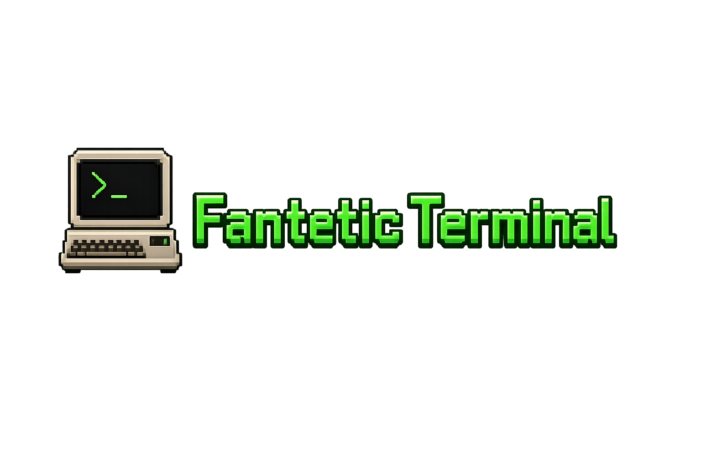
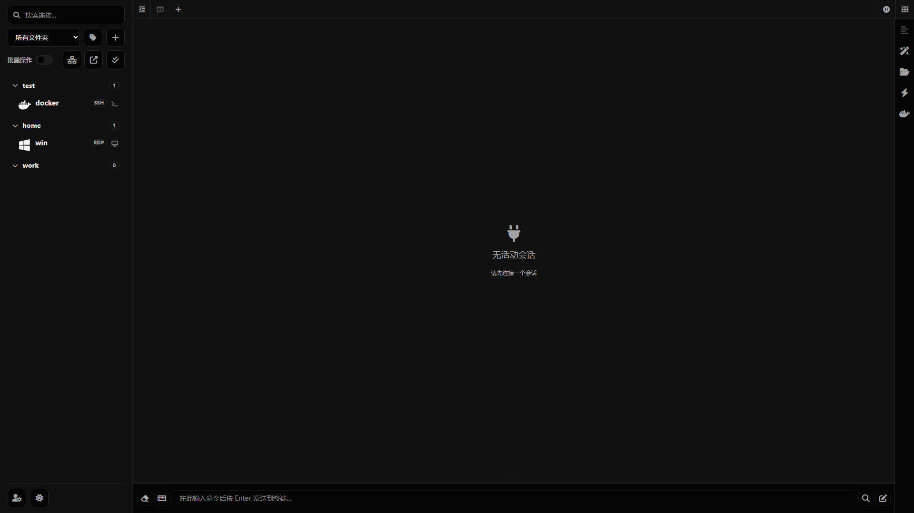
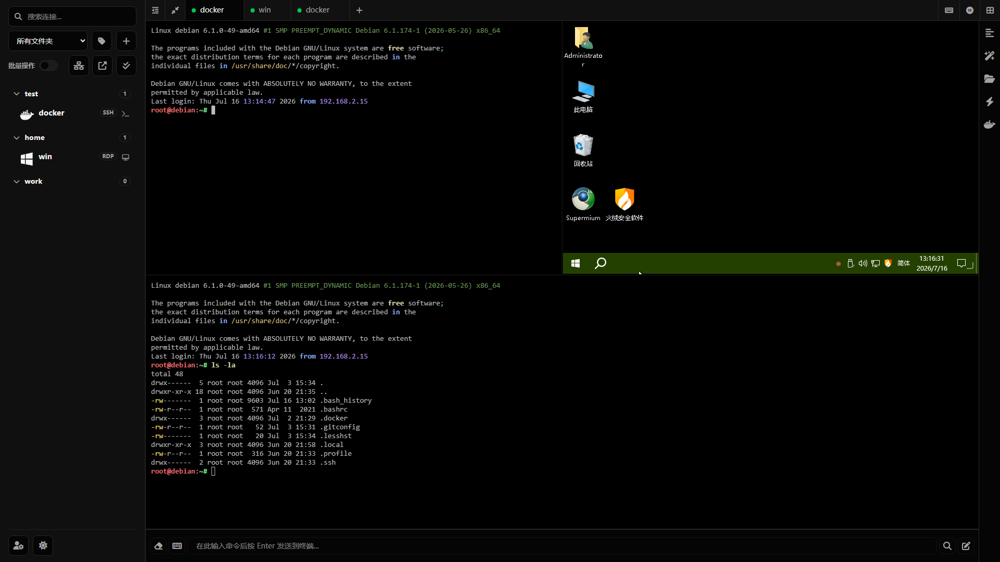
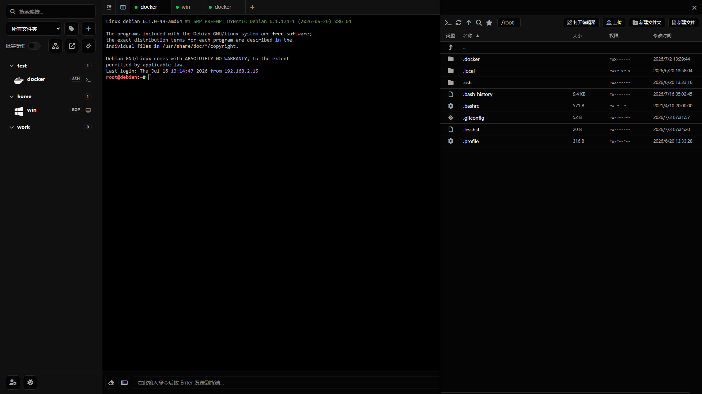
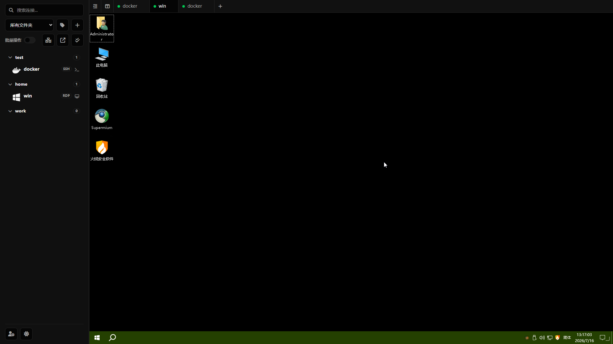
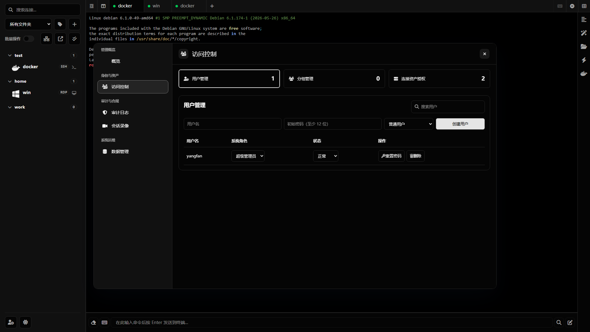

<div align="center">



# Fantetic Terminal

### 面向 SSH、RDP、VNC 和 SFTP 的现代化远程工作空间

**Web 终端 · 远程桌面 · SFTP · 会话录像 · 管理中心 · Electron 桌面端**

<br />

[English](./README.md) | [中文](./README_CN.md)

[](#快速开始)
[](./LICENSE)
[](https://github.com/spfantop/fantetic-terminal/releases)
[](https://www.typescriptlang.org/)
[](https://vuejs.org/)
[](./electron-app)

<br />

**Fantetic Terminal** 是一个可私有部署的现代化远程访问工作空间，适合开发者、DevOps 团队、Homelab 用户和小型团队使用。

它将 **SSH**、**Telnet**、**RDP**、**VNC**、**SFTP**、会话管理、审计、录像、备份恢复和桌面端能力整合到一个现代化界面中。

<br />

[快速开始](#快速开始) · [功能特性](#功能特性) · [界面预览](#界面预览) · [产品对比](#产品对比) · [架构设计](#架构设计) · [路线图](#路线图)

</div>

---

## 为什么选择 Fantetic Terminal？

大多数远程访问工具只专注于工作流中的某一个环节。

Fantetic Terminal 的目标不是做一个简单的 Web SSH 页面，而是打造一个完整的 **远程工作空间**。

| 你的需求         | Fantetic Terminal 提供             |
| ------------ | -------------------------------- |
| 管理 Linux 服务器 | SSH、Telnet、多标签、分屏、会话挂起           |
| 管理服务器文件      | SFTP、拖拽上传、在线编辑、文件操作              |
| 访问远程桌面       | 通过独立 Remote Gateway 支持 RDP 和 VNC |
| 像应用一样使用      | Web、PWA 和 Electron 桌面端           |
| 管理团队权限       | 用户、用户组、角色和资产授权                   |
| 审计访问行为       | 审计日志和加密终端录像                      |
| 完全私有部署       | Docker 部署，数据自持有                  |

---

## 预览
<div align="center">


</div>

---

## 功能特性

- 结构化审计上下文，可关联操作者、请求、IP、资产、会话和执行结果。
- 基于角色的管理中心，统一提供访问控制、审计调查、录像和数据管理。
- SSH/Telnet 加密会话录像，支持筛选、流式回放、取消请求和有界事件缓存。
- RDP/VNC 加密双向 Guacamole 协议转录，用于留存取证；仓库未内置其浏览器或终端回放适配器。
- 支持创建校验备份、完整性验证、引导式恢复计划和异常中断录像恢复。

### 远程工作空间

* SSH 和 Telnet 终端会话
* 多标签、分屏和独立窗口
* 会话重连、心跳和挂起恢复
* 命令历史、快捷命令和路径历史
* 可自定义终端布局和外观
* 移动端友好的终端交互
* PWA 支持

### 文件管理

* SFTP 文件管理器
* 拖拽上传
* 多选文件操作
* 重命名、复制、移动、删除和权限修改
* 压缩和解压
* 基于 Monaco Editor 的在线编辑
* 移动端 CodeMirror 编辑器
* 常用路径和路径历史

### 远程桌面

* RDP 访问
* VNC 访问
* 独立 Remote Gateway 隔离边界
* 一次性远程桌面授权
* guacd 集成

### 管理能力

* 多用户管理
* 系统角色：`super_admin`、`admin`、`auditor`、`user`
* 用户组和资产授权
* 查看、连接和管理权限
* 批量资产授权
* 删除用户时支持资产转移
* 基于角色的管理中心

### 安全能力

* Passkey 支持
* 验证码
* 双因素认证
* IP 黑白名单
* HTTP 和 WebSocket Origin 校验
* 用户级限流
* 会话吊销
* 敏感日志脱敏
* 通知凭据加密
* Electron 沙箱和 IPC 来源校验

### 审计、录像和恢复

* 结构化审计日志
* 关联操作人、请求、IP、资产和会话
* 加密 SSH/Telnet 会话录像
* 录像搜索、筛选和回放
* 备份创建
* 备份完整性校验
* 引导式恢复调度
* 中断录像恢复

### 桌面客户端

* 独立 Electron 桌面客户端
* Windows 安装包和便携包
* 本地优先运行模式
* 每次启动生成后端随机 nonce
* 受限的渲染进程权限

> 桌面客户端主要面向本地终端使用场景。Web 多用户管理和完整 RDP/VNC 网关能力由私有部署的服务端提供。

---

## 界面预览

### 终端工作区



### 分屏模式



### 文件管理器



### 远程桌面



### 管理中心



---

## 快速开始

### 1. 运行单镜像

单镜像已内置前端、后端、Remote Gateway 和 guacd，无需 Compose 即可使用 SSH、SFTP、RDP 与 VNC。

```bash
docker run -d --name fantetic-terminal \
  --restart unless-stopped \
  -p 18111:80 \
  -v fantetic-terminal-data:/app/data \
  spfantop/fantetic-terminal:latest
```

命名卷会持久化数据库、录像、备份和自动生成的密钥。通过以下命令查看全部服务日志：

```bash
docker logs -f fantetic-terminal
```

### 2. 打开 Web 界面

```text
http://localhost:18111
```

### 高级用法：Compose 部署

仅在需要分别升级或扩缩前端、后端、Remote Gateway 时使用 Compose。

### 下载 Compose 文件

```bash id="dfzurr"
mkdir ./fantetic-terminal
cd ./fantetic-terminal

wget https://raw.githubusercontent.com/spfantop/fantetic-terminal/refs/heads/main/docker-compose.yml -O docker-compose.yml
wget https://raw.githubusercontent.com/spfantop/fantetic-terminal/refs/heads/main/.env.example -O .env
```

### 启动 Fantetic Terminal

```bash id="gx9lyy"
docker compose pull
docker compose up -d
```

使用已发布的 Docker 镜像部署时，不需要拉取源码。

---

## 配置说明

首次启动时，后端会自动生成强随机值：

* `ENCRYPTION_KEY`
* `SESSION_SECRET`
* `REMOTE_GATEWAY_SHARED_SECRET`

这些值会保存到：

```text id="uyjl5y"
./data/.env
```

请妥善保存该文件，并将其纳入备份。

删除或替换该文件可能导致历史加密数据无法解密，并使当前会话失效。

生产环境请在 `.env` 中配置：

```env id="kkd8ov"
RP_ID=your-domain.com
RP_ORIGIN=https://your-domain.com
CORS_ALLOWED_ORIGINS=https://your-domain.com
```

生产环境建议使用 HTTPS。安全 Cookie、剪贴板、Passkey 等浏览器能力在非 HTTPS 来源下可能无法正常工作，localhost 除外。

---

## 反向代理示例

```nginx id="mnt4w6"
location / {
    proxy_http_version 1.1;
    proxy_set_header Upgrade $http_upgrade;
    proxy_set_header Connection "upgrade";
    proxy_set_header X-Forwarded-For $proxy_add_x_forwarded_for;
    proxy_set_header X-Forwarded-Proto $scheme;
    proxy_set_header Host $http_host;
    proxy_set_header X-Real-IP $remote_addr;
    proxy_set_header Range $http_range;
    proxy_set_header If-Range $http_if_range;
    proxy_redirect off;
    proxy_pass http://127.0.0.1:18111;
}
```

---

## ARM 说明

对于 `arm64`，请将：

```yaml id="b40yoy"
guacamole/guacd:latest
```

替换为：

```yaml id="api0ym"
guacamole/guacd:1.6.0-RC1
```

对于 `armv7`，请使用专用 Compose 文件。由于 guacd 未提供 armv7 镜像，armv7 环境下 RDP/VNC 功能不可用。

Compose 文件默认跟踪 frontend、backend 和 Remote Gateway 的最新镜像。升级已有部署前，请同时拉取三个镜像，并查看该镜像集对应的发布说明。

---

## 架构设计

```text id="utd8ty"
Browser / PWA / Electron
        |
        v
Frontend
        |
        v
Backend API + WebSocket
        |
        +-------------------+
        |                   |
        v                   v
SSH / Telnet / SFTP     Remote Gateway
                            |
                            v
                          guacd
                            |
                     +------+------+
                     |             |
                    RDP           VNC
```

Fantetic Terminal 采用 Monorepo 结构：

```text id="bqfy51"
fantetic-terminal
├── packages
│   ├── backend
│   ├── contracts
│   ├── frontend
│   └── remote-gateway
├── electron-app
├── build-tools
├── docs
├── docker-compose.yml
└── package.json
```

---

## 产品对比

| 功能           | Fantetic Terminal | Nexterm | Apache Guacamole | JumpServer |
| ------------ | ----------------: | ------: | ---------------: | ---------: |
| SSH 终端       |                 ✅ |       ✅ |                ✅ |          ✅ |
| Telnet       |                 ✅ |       ✅ |                ✅ |          ✅ |
| SFTP 文件管理    |                 ✅ |       ✅ |                ❌ |          ✅ |
| RDP          |                 ✅ |      ⚠️ |                ✅ |          ✅ |
| VNC          |                 ✅ |      ⚠️ |                ✅ |          ✅ |
| Web 界面       |                 ✅ |       ✅ |                ✅ |          ✅ |
| Electron 桌面端 |                 ✅ |       ❌ |                ❌ |          ❌ |
| PWA          |                 ✅ |      ⚠️ |                ❌ |          ❌ |
| 多用户管理        |                 ✅ |       ✅ |               ⚠️ |          ✅ |
| 用户组          |                 ✅ |      ⚠️ |                ❌ |          ✅ |
| 资产授权         |                 ✅ |       ✅ |               ⚠️ |          ✅ |
| 会话录像         |                 ✅ |       ❌ |               ⚠️ |          ✅ |
| 管理中心         |                 ✅ |       ✅ |               ⚠️ |          ✅ |
| 轻量化私有部署      |                 ✅ |       ✅ |                ✅ |         ⚠️ |
| 企业级堡垒机能力     |                ⚠️ |      ⚠️ |                ❌ |          ✅ |

> 上述对比基于产品定位和常见部署方式。不同版本和部署场景下，具体能力深度可能存在差异。

---

## 项目定位

Fantetic Terminal 当前更适合以下场景：

* 个人服务器管理
* Homelab 环境
* 小团队远程访问
* 轻量级 DevOps 工作空间
* 私有部署的远程终端和远程桌面管理
* 希望在一个平台中统一使用 SSH、SFTP、RDP 和 VNC 的团队

它目前**还不定位为完整企业级堡垒机替代品**。

---

## 路线图

### 已完成

* SSH 终端
* Telnet 终端
* SFTP 文件管理
* RDP 和 VNC 网关
* 多标签工作区
* 分屏
* 会话挂起
* 多用户管理
* 用户组和资产授权
* Passkey、验证码和双因素认证
* 审计日志
* 加密终端录像
* 备份和恢复
* PWA
* Electron 桌面客户端

### 进行中 / 计划中

* 更好的终端高亮
* 更接近 WindTerm 的终端体验
* RDP 剪贴板增强
* RDP 文件传输增强
* 远程桌面多窗口工作流
* 更完整的审计追踪体验
* PostgreSQL 支持
* 插件系统
* 更多部署模板
* 公开演示环境

---

## 开发

```bash id="qvof5e"
git clone https://github.com/spfantop/fantetic-terminal.git
cd fantetic-terminal

npm install
npm run dev
```

构建：

```bash id="8ph73x"
npm run build
```

桌面端打包：

```bash id="0v1ali"
cd electron-app
npm install
npm run build
```

---

## 安全说明

Fantetic Terminal 会处理服务器凭据、私钥、会话令牌和远程访问流量等敏感数据。

生产环境使用前，请务必：

* 启用 HTTPS
* 妥善保存 `./data/.env`
* 备份挂载的 `data` 目录
* 检查反向代理配置
* 限制可信 Origin
* 使用强管理员密码
* 尽可能启用双因素认证
* 确认终端输入录像是否符合你的组织规范和法律要求

---

## 致谢

Fantetic Terminal 基于 [Heavrnl/nexus-terminal](https://github.com/Heavrnl/nexus-terminal) 开发。

感谢原作者以及所有让本项目成为可能的开源项目。

终端配色预设基于 [iTerm2-Color-Schemes](https://github.com/mbadolato/iTerm2-Color-Schemes)。

---

## 许可证

Fantetic Terminal 使用 [GPL-3.0](./LICENSE) 许可证。

---

<div align="center">

如果你觉得 Fantetic Terminal 对你有帮助，欢迎点一个 Star。

**Star · Fork · 分享 · 贡献**

</div>
