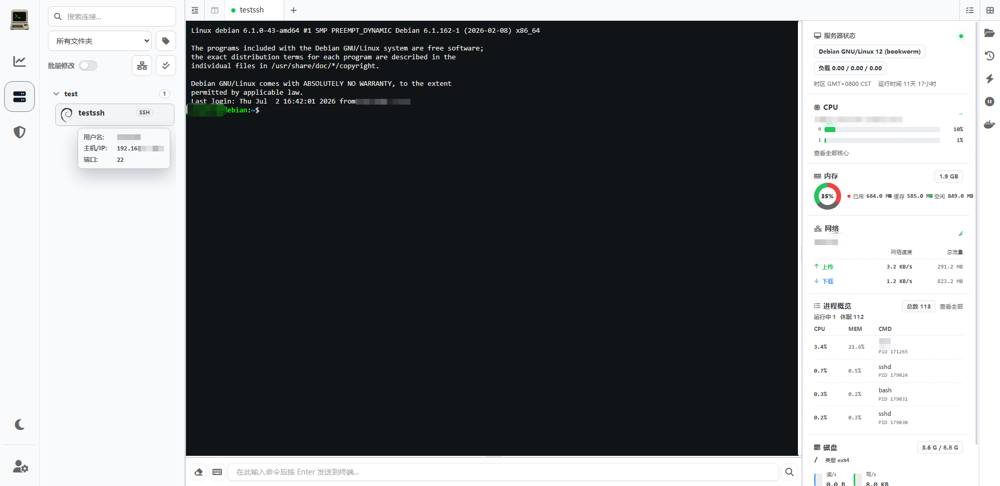
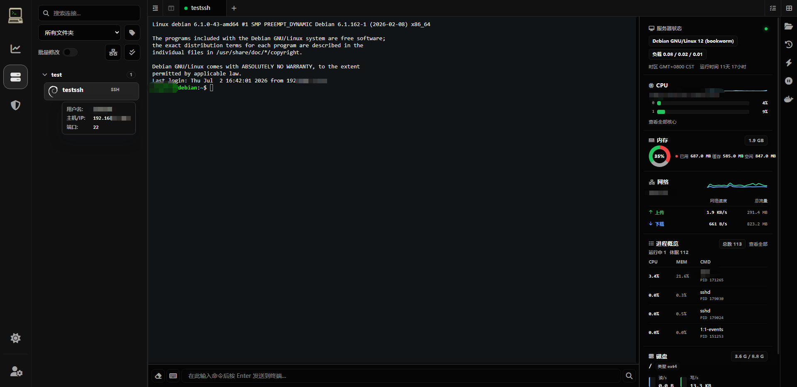
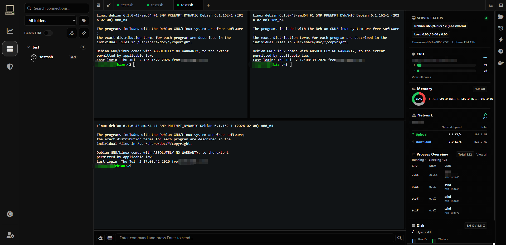
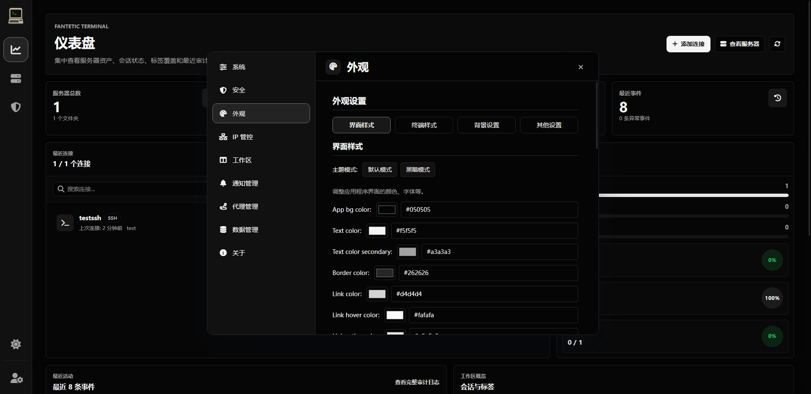

---

<div align="center">

[][docker-url] [](https://github.com/spfantop/fantetic-terminal/blob/main/LICENSE)

[English](./README.md) | [中文](./README_CN.md)

[docker-url]: https://hub.docker.com/r/spfantop/fantetic-terminal-frontend

</div>

## 📖 概述

**Fantetic Terminal** 是一个现代化的 Web 与桌面远程访问工作台，支持 SSH、Telnet、RDP 和 VNC，并将终端会话、SFTP 文件管理、在线编辑、管理控制、审计、加密录像及校验备份恢复整合到可高度定制的界面中。

本项目基于 [Heavrnl/nexus-terminal](https://github.com/Heavrnl/nexus-terminal) 开发，感谢原作者。

- 当前维护仓库：[spfantop/fantetic-terminal](https://github.com/spfantop/fantetic-terminal)
- 源项目：[Heavrnl/nexus-terminal](https://github.com/Heavrnl/nexus-terminal)

## ✨ 功能特性

### 远程工作台

- SSH 与 Telnet 终端，支持多标签页、分屏、弹出窗口、自动重连、心跳保活和会话挂起。
- SFTP 文件管理，支持拖拽上传、多选、重命名、权限修改、复制/移动、压缩及在线编辑。
- 通过隔离的 Remote Gateway 信任边界支持 RDP/VNC。
- Monaco Editor 与移动端 CodeMirror 编辑器，仅在真实编辑请求出现时按需加载。
- 快捷指令、命令历史、路径历史、收藏路径、Docker 工具、状态监控及自定义布局。
- 支持 PWA 和独立 Electron 桌面客户端。

### 管理与安全

- 多用户账户体系，提供 `super_admin`、`admin`、`auditor`、`user` 系统角色。
- 用户组提供 owner/admin/operator/viewer 角色，并支持连接的查看/连接/管理权限。
- 支持批量资产授权、私有资源隔离，以及删除用户时转移资产。
- 支持 Passkey、验证码、2FA、IP 白名单/黑名单、认证纪元会话撤销和通知凭证加密。
- 凭证感知的结构化日志；密码、私钥、passphrase、token 和 SQL 参数不会写入日志。
- 严格的 HTTP/WebSocket Origin、路径白名单、用户级限流、有界消息队列和一次性 RDP/VNC grant。
- Electron 启用 sandbox、导航/窗口限制、IPC sender 校验和每次启动随机后端 nonce。

### 审计、录像与恢复

- 结构化审计上下文，可关联操作者、请求、IP、资产、会话和执行结果。
- 基于角色的管理中心，统一提供访问控制、审计调查、录像和数据管理。
- SSH/Telnet 加密会话录像，支持筛选、流式回放、取消请求和有界事件缓存。
- 支持创建校验备份、完整性验证、引导式恢复计划和异常中断录像恢复。

### 可靠性与性能

- SQLite WAL/运行参数优化、可控启停、运行期密钥生成和幂等资源清理。
- 有界终端输出缓冲及 SSH 流 pause/resume 背压。
- 编辑器、设置页和管理页按需加载，不再打包 Element Plus 全量 CSS。
- 可复现的前后端/桌面端构建，以及交付与安全行为测试。

更多设计背景和后续工作请参阅：[架构审计](./docs/ARCHITECTURE_AUDIT.md)、[发布指南](./docs/RELEASE.md) 和 [部署安全](./docs/deployment-security.md)。

## 📸 截图

| 终端界面（Light） |
|:--:|
|  |

| 终端界面（Dark） |
|:--:|
|  |

| 分屏界面 |
|:--:|
|  |

| 设置界面（Dark） |
|:--:|
|  |

## 🖥️ 桌面客户端

桌面端安装包可在[最新 Release](https://github.com/spfantop/fantetic-terminal/releases/latest)中下载。

桌面运行时以本地使用为主，不开放 Web 多用户管理或内置 RDP/VNC Gateway 能力。它通过每次启动随机 nonce 和受限 Electron Renderer 权限保护 loopback 后端。

## 🚀 快速开始

### 1️⃣ 准备配置

```bash
mkdir ./fantetic-terminal && cd ./fantetic-terminal
wget https://raw.githubusercontent.com/spfantop/fantetic-terminal/refs/heads/main/docker-compose.yml -O docker-compose.yml
wget https://raw.githubusercontent.com/spfantop/fantetic-terminal/refs/heads/main/.env.example -O .env
```

生成相互独立的密钥并填写到 `.env`：

```bash
node -e "console.log(require('crypto').randomBytes(32).toString('hex'))"
node -e "console.log(require('crypto').randomBytes(64).toString('hex'))"
```

必需配置：

- `ENCRYPTION_KEY`：64 位十六进制字符。
- `SESSION_SECRET`：至少 32 位随机字符。
- `REMOTE_GATEWAY_SHARED_SECRET`：至少 32 位随机字符，Backend 与 Remote Gateway 必须一致。
- `RP_ID` / `RP_ORIGIN`：Passkey 使用的公开域名与 Origin。
- `CORS_ALLOWED_ORIGINS`：需要额外信任的前端 Origin，使用逗号分隔。

> ⚠️ **arm64 用户**在部署 guacd 时，请按环境将 `guacamole/guacd:latest` 替换为 `guacamole/guacd:1.6.0-RC1`。**armv7 用户**请使用[专用 Compose 文件](./doc/arm/docker-compose.yml)；由于 guacd 没有 ARMv7 镜像，RDP/VNC 会被禁用。

### 2️⃣ 配置反向代理

```nginx
location / {
    proxy_http_version 1.1;
    proxy_set_header Upgrade $http_upgrade;
    proxy_set_header Connection "upgrade";
    proxy_set_header X-Forwarded-For $proxy_add_x_forwarded_for;
    proxy_set_header X-Forwarded-Proto $scheme;
    proxy_set_header Host $http_host;
    proxy_set_header X-Real-IP $remote_addr;
    proxy_set_header Range $http_range;
    proxy_set_header If-Range $http_if_range;
    proxy_redirect off;
    proxy_pass http://127.0.0.1:18111;
}
```

生产环境请使用 HTTPS。除 localhost 外，非 HTTPS Origin 可能无法使用剪贴板、Passkey、安全 Cookie 等浏览器能力。

### 3️⃣ 启动与更新

```bash
docker compose up -d
```

```bash
docker compose down
docker compose pull
docker compose up -d
```

仅使用已发布镜像时，不需要拉取仓库源码。

## 📚 使用指南

### 挂起会话

在 SSH 标签页上右键选择“挂起会话”，移动端可长按标签。后端会接管 SSH 连接，使编译等长任务在浏览器断开后继续运行；之后可在挂起会话面板中恢复。

### 命令输入框

1. 输入框聚焦时，使用 `Alt + ↑/↓` 切换 SSH 标签，使用 `Alt + ←/→` 切换编辑器标签。
2. 开启命令同步后，输入内容会同步到选定终端；使用 `↑/↓` 和 `Enter` 选择并发送建议命令。

### 文件管理器

1. 在搜索框内使用 `↑/↓` 快速选择文件。
2. 从系统拖入文件或文件夹即可上传；大量或深层目录建议先压缩。
3. 在文件管理器内部拖拽条目可执行移动。
4. 按住 `Ctrl` 或 `Shift` 可多选。
5. 右键菜单提供复制、剪切、粘贴、删除、重命名和权限修改。

### 终端与工作区

1. `Ctrl + Shift + C` 复制，`Ctrl + Shift + V` 粘贴。
2. 在终端、文件管理器、编辑器和快捷指令视图中使用 `Ctrl + 鼠标滚轮` 缩放。
3. 展开的侧栏可拖拽调整宽度。
4. SSH 与文件管理器标签支持关闭左侧/其他/右侧标签页。
5. 连接断开后，在终端或命令输入框按回车，或再次点击同一连接，可触发重连。
6. 移动端可通过双指手势调整终端字体。

### 管理中心

- 系统管理员可在管理中心维护用户、用户组、授权、备份和恢复请求。
- 审计员可调查结构化审计事件和关联录像，但不会获得配置管理权限。
- 恢复前会校验备份完整性。仍建议额外备份挂载的 `data` 目录，作为灾难恢复保障。

## ⚠️ 注意事项

1. 双文件管理器布局仍属于实验性功能。
2. 同一布局暂不支持多个相互独立的文本编辑器。
3. 会话录像可能包含终端输入；开启 `SESSION_RECORD_INPUT` 前请确认法律与组织策略。
4. RDP/VNC 需要正确配置 guacd 和 Remote Gateway。
5. 内置备份流程不能替代对 `data` 目录的外部备份。

## 💐 致谢

- 终端配色预设来源于 [iTerm2-Color-Schemes](https://github.com/mbadolato/iTerm2-Color-Schemes)。

## 📄 开源协议

Fantetic Terminal 使用 [GPL-3.0](LICENSE) 开源协议。
